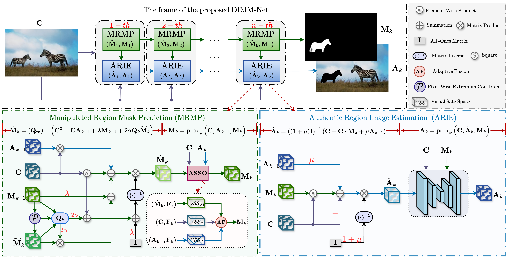

# <center> Deep Unfolding Network with Dual-Domain Joint Modeling for Image Manipulation Localization

Existing image manipulation localization (IML) methods achieve reasonable performance but generally overlook the explicit relationship between the manipulation mask and the RGB image during region separation, which limits localization accuracy. In practice,  uncertain regions in the mask manifest as color distortion in the RGB domain. Guiding the network to process these uncertain regions enables more accurate manipulation localization. Based on this observation, we propose a deep unfolding network with dual-domain joint modeling (DDJM-Net), which formulates IML as a manipulated‑authentic region separation process. In this process, we construct an energy function to achieve joint optimization of manipulation localization and distortion restoration. Then, grounded in rigorous mathematical optimization theory, the iterative optimization steps of the model are unfolded into a multi-stage iterative solution network architecture with clear interpretability. At each stage, the Manipulated Region Mask Prediction (MRMP) and the Authentic Region Image Estimation (ARIE) modules, with the goal of minimizing distortion, alternately optimize the manipulation mask and the authentic region respectively following an alternating optimization strategy. As the iteration stages progress, DDJM‑Net concentrates on handling uncertain regions in the region separation process, significantly improving the accuracy of manipulation localization. Extensive experiments confirm the strong performance of DDJM-Net, thereby validating the effectiveness of our theoretical framework and its significance for paradigm innovation.

## 🚀 DDJM-Net
<div align="center">
    
</div>
<!--  -->


## 📆 TODO
Our complete codebase will be released upon paper acceptance.

Welcome to watch 👀 this repository for the latest updates.

- [x] [2026.6.21]: The relevant core code has been released.
- [x] [2026.6.23]: The evaluation code has been released.
- [ ] The loss function code has been released.
- [ ] The complete model code.
- [ ] Training code released.

## 🎮 Getting Started

### 1. Install DDJM-Net Environment

```bash
conda create -n DDJM-Net python=3.8
conda activate DDJM-Net
pip install torch==1.13.0 torchvision==0.14.0 torchaudio==0.13.0 --extra-index-url https://download.pytorch.org/whl/cpu
pip install nvitop
pip install timm==0.4.12
pip install triton==2.0.0
```


### 2. Prepare Datasets
| Dataset     | Nums        |  #CM          | #SP          | #IP          |  #Train          |  #Test          |
| :----:      |    :----:   |         :----:|:----:        |    :----:    |         :----:   |         :----:  |
| CASIAv2   | 5123        | 3295          |1828          |    0         |        5123      |        0        |
| CASIAv1   | 920         | 459           |461           |    0         |        0         |        920      |
| Coverage    | 100         | 100           |0             |    0         |        70        |        30       |
| NIST16-C | 564         | 68            |288           |    208       |       383       |      181      |
| Columbia    | 180         | 0             |180           |    0         |         130      |        50       |
|In-the-wild   | 201 | -|201|-|0|201|
|DSO     | 100 | -|100|-|0|100|
|IMD2020|2010|-|-|-|0|2010|
|CocoGlide|512|-|-|-|0|512|
- CASIAv2 [Download](https://github.com/SunnyHaze/IML-Dataset-Corrections)
- CASIAv1 [Download](https://github.com/SunnyHaze/IML-Dataset-Corrections)
- Columbia  [Download](https://www.ee.columbia.edu/ln/dvmm/downloads/authsplcuncmp/)
- Coverage  [Download](https://github.com/wenbihan/coverage?tab=readme-ov-file)
- NIST16-C    [Download](https://mfc.nist.gov/users/sign_in)
- CocoGlide [Download](https://www.grip.unina.it/download/prog/TruFor/CocoGlide.zip)
- IMD 2020[Download](https://staff.utia.cas.cz/novozada/db/)

### 3. Train

To train our DDJM-Net model, first ensure that the pretrained [Res2Net-50](https://github.com/Res2Net) weights are ready, and then simply run the corresponding training script.
```bash

bash train.sh
```
### 4. Test
```bash
python Test.py
```

