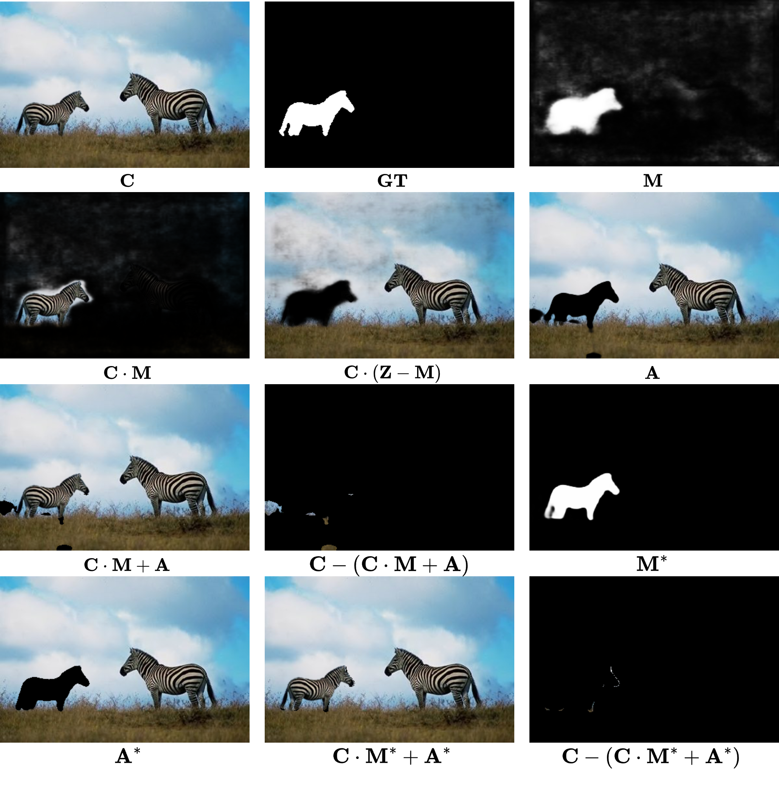

<div align="center">
<h1> Deep Unfolding Network with Dual-Domain Joint Modeling for Image Manipulation Localization </h1>
</div>


## 📆 TODO
Our complete codebase will be released upon paper acceptance.

Welcome to watch 👀 this repository for the latest updates.

- [x] [2026.3.26]: The relevant core code has been released.
- [x] [2026.3.26]: The evaluation code has been released.
- [ ] The loss function code has been released.
- [ ] The complete model code.
- [ ] Training code released.


## ✨ Highlights
* 🧬**Novel Modeling Perspectives:** By integrating dual-domain joint modeling with the MRMP and ARIE modules, DDJM-Net reformulates IML as a separation process between manipulated and authentic regions, providing a new modeling perspective for IML.
* 🔀**Interpretability Optimization Process:** DDJM-Net models the manipulated-authentic region separation process from an optimization perspective and integrates a deep unfolding network to map the iterative optimization procedure into a multi-stage architecture, thereby providing strong interpretability.
* 🛡️**Excellent Experimental Performance:** Experimental results show that DDJM-Net achieves superior localization accuracy, generalization ability, and robustness, further validating the effectiveness of the proposed theoretical framework and the soundness of its modeling strategy.


## 📖 Introduction
<div align="center"> 
   
</div>


> **Fig. 1: Manipulation localization and distortion restoration.** Based on the predicted mask $`\mathbf{M}`$, the manipulated image $`\mathbf{C}`$ is separated into the manipulated region $`\mathbf{C} \cdot \mathbf{M}`$ and the authentic region $`\mathbf{C} \cdot (\mathbf{Z} - \mathbf{M})`$, where $`\mathbf{Z}`$ denotes an all-ones mask. The uncertainty in $`\mathbf{M}`$ causes color distortion in both regions. For the region separation task, DDJM-Net employs different modules to estimate the manipulation mask $`\mathbf{M}`$ and the authentic region $`\mathbf{A}`$. Due to inconsistent pixel-level judgments, their reconstruction $`\mathbf{C} \cdot \mathbf{M} + \mathbf{A}`$ exhibits color distortion, which is quantified by the difference map $`\mathbf{C} - (\mathbf{C} \cdot \mathbf{M} + \mathbf{A})`$. Through joint optimization of manipulation localization and distortion restoration, DDJM-Net yields $`\mathbf{M}^{*}`$ and $`\mathbf{A}^{*}`$ with fewer uncertain regions, thereby achieving more accurate localization and markedly lowering color distortion in both the reconstruction and the difference map.


## 🧩 Overview
<div align="center"> 
   
</div>


> **Fig. 2: Overview of the DDJM-Net framework.** Designed around the manipulated‑authentic region separation process, its architecture comprises two core modules: the Manipulated Region Mask Prediction (MRMP) module and the Authentic Region Image Estimation (ARIE) module.


## 🗂️Prepare Datasets

A summary of the datasets used in the experiments, showing their manipulation types (CM: copy-move, SP: splicing, IP: inpainting) and the train-test splits.

<div align="center">

|   Dataset   | Nums | #CM  | #SP  | #IP  | #Train | #Test |
| :---------: | :--: | :--: | :--: | :--: | :----: | :---: |
|   CASIAv2   | 5123 | 3295 | 1828 |  0   |  5123  |   0   |
|   CASIAv1   | 920  | 459  | 461  |  0   |   0    |  920  |
|  Coverage   | 100  | 100  |  0   |  0   |   70   |  30   |
|  NIST16-C   | 564  |  68  | 288  | 208  |  383   |  181  |
|  Columbia   | 180  |  0   | 180  |  0   |  130   |  50   |
| In-the-wild | 201  |  -   | 201  |  -   |   0    |  201  |
|     DSO     | 100  |  -   | 100  |  -   |   0    |  100  |
|   IMD2020   | 2010 |  -   |  -   |  -   |   0    | 2010  |
|  CocoGlide  | 512  |  -   |  -   |  -   |   0    |  512  |

</div>

* [CASIAv2](https://github.com/SunnyHaze/IML-Dataset-Corrections)
* [CASIAv1](https://github.com/SunnyHaze/IML-Dataset-Corrections)
* [Columbia](https://www.ee.columbia.edu/ln/dvmm/downloads/authsplcuncmp/)
* [NIST16-C](https://mfc.nist.gov/users/sign_in)
* [CocoGlide](CocoGlide)
* [IMD 2020](https://staff.utia.cas.cz/novozada/db/)


## 💻 Environment Setup

We recommend using **Anaconda** or **Miniconda** to manage the Python environment.

```bash
# 1. Create and activate a new environment with Python 3.8
conda create -n DDJM-Net python=3.8 -y
conda activate DDJM-Net

# 2. Install PyTorch (Conda is recommended for CUDA compatibility)
conda install pytorch==2.1.2 torchvision==0.16.2 torchaudio==2.1.2 pytorch-cuda=11.8 -c pytorch -c nvidia

# 3. Install Environment
numpy==1.24.4
timm==1.0.15
scipy==1.15.3
einops==0.8.1
faiss-gpu==1.7.2
scikit-learn==1.7.0
tensorboardX==2.6.4
medpy==0.5.2
seaborn==0.13.2
segmentation_mask_overlay==0.4.4
thop==0.1.1.post2209072238
h5py==3.14.0
torchsummaryX==1.3.0
imgaug==0.4.0
```


---
## 🚀 Training

To train the DDJM‑Net model, please use the provided `train.sh` script. Before execution, ensure that the pretrained  [Res2Net-50](https://github.com/Res2Net) weights have been downloaded and adjust the relevant hyperparameters—such as learning rate, batch size, and number of training epochs—within the script according to your dataset and computational resources. Once configured, simply run the script to commence training.

```bash
bash train.sh
```

## 📊 Testing

For evaluation, run `Test.py`, which generates visualizations and computes the pixel‑level F1 score simultaneously.

```
python Test.py
```

---
## 🎨 Visualization Results

<div align="center">  </div>

> **Fig. 3: Visual comparison of different methods on representative manipulated examples, including single-object, multi-object, complex-object and mixed cases..**

## 📜 License

This project is licensed under the [Apache 2.0 License](https://github.com/vpsg-research/LIDMark/blob/main/LICENSE).


---
